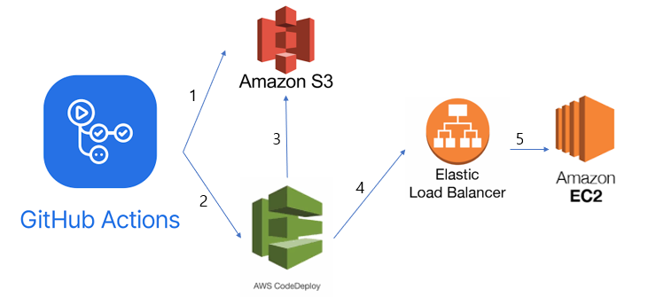
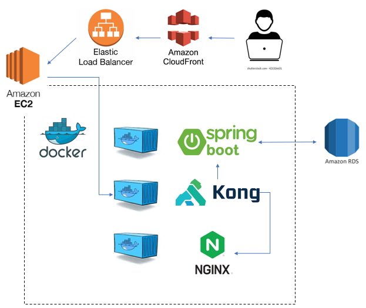

# 예쁜 손 글씨 홍보 사이트 입니다.

예쁜글씨, 캘리그라피, 폼아트, 토탈공예를 활용한 작품를 소개하기위한 홍보사이트를 위해 재작한 
BACK-END APPLICATION 입니다.

> 웹 사이트 페이지 구성을 위한 FRONT 프로젝트는 [다음](https://github.com/yudonggeun/handwriting-promotion)을 참고해주세요.

## Stacks

### Development

<div style="display: flex;">
    
    
</div>

### Deploy

<div style="display: flex;">
    
    
    
    
</div>

## 시작 가이드

* 실행하기
```bash
docker compose up
```
* 접속 주소
개시된 컴포즈 파일은 local 에서 실행될 것을 염두에 두고 설정을 하였다.
```
http://localhost
```
* 초기 관리자 유저
```
id=admin
password=1234
```

## 구현 기능
* 홍보글 CRUD
* 이미지 파일 관리
* JWT를 이용한 사용자 로그인
* 이미지 압축
* oath 로그인(구글, 카카오)

## 아키텍처
### 배포 파이프라인




### 서비스 구조


