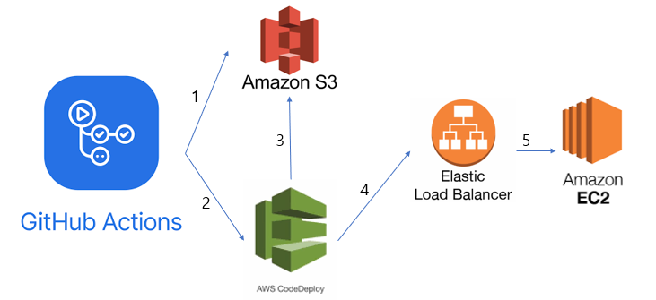
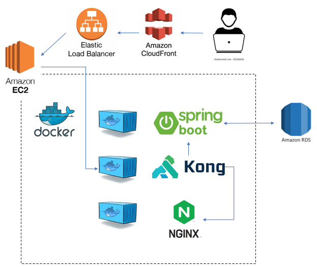

# Beautiful Handwriting Promotion Site
This is a BACK-END APPLICATION created for a promotional website to showcase works utilizing beautiful handwriting, calligraphy, foam art, and total crafts.

> For the FRONT project for web site page composition, please refer to this [link](https://github.com/yudonggeun/handwriting-promotion).

## Stacks

### Development

<div style="display: flex;">
    
    
</div>

### Deploy

<div style="display: flex;">
    
    
    
    
</div>

## Getting Started

* To run
```bash
docker compose up
```
* Access address : The published compose file is configured with local execution in mind.
```
http://localhost
```
* Initial admin user
```
id=admin
password=1234
```
## Implemented Features

* CRUD operations for promotional posts
* Image file management
* User login using JWT
* Image compression
* OAuth login (Google, Kakao)

## Architecture
### Deployment Pipeline



### Service Structure


